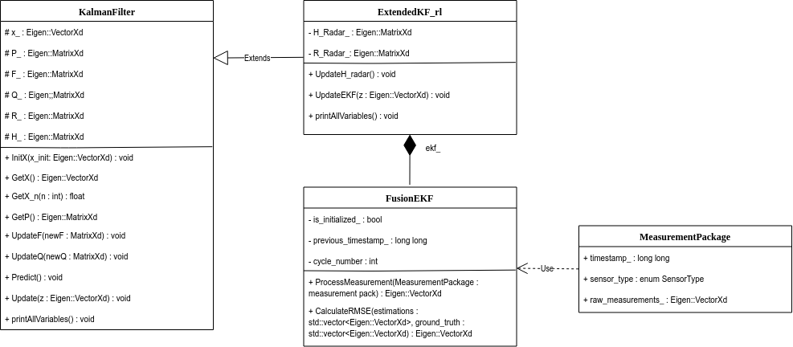
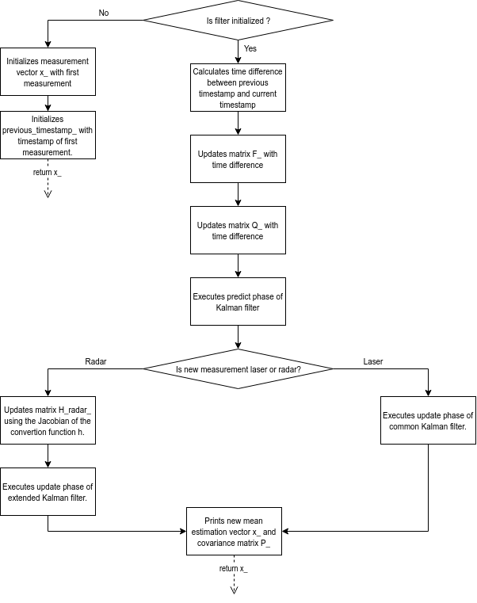

# Self Driving Car Nanodegree 

## Project 5: Extended Kalman Filter

This project consists of a sensor fusion system with radar and laser which measure the position of another car respective to an origin point where the sensors are located. In order to combinate the data, an extended Kalman filter is used. The system estimates the 2D position of the other car and its speed. 

This software is programmed in C++ 11 using the standard template library and the external library Eigen for linear algebra calculations. 

The software was debugged using 500 radar and laser measurements saved in a csv file. 

In order to visualize the results of the software, the [ Udacity term 2 simulator ](https://github.com/udacity/self-driving-car-sim) is used. To communicate this software with the simulator the [uWebSockets API](https://github.com/uNetworking/uWebSockets) is used. 

To compile the software, GCC 7.4.0 and CMake 3.15.0-rc1 is used.

### About the algorithms

The purpose of this software is to implement an extended Kalman filter which can combinate radar and laser data. In this section it is explained briefly how the algorithm works.

A Kalman filter is an algorithm which uses noisy measurements of different sensors in order to get more accurate values of the observable variables (the ones sensed) and estimate other non observable variables. These values are represented by a gaussian distribution with mean x and covariance P. x is a vector of length n including n estimated variables and P is a matrix of dimensions nxn including the covariances between the n estimated variables.

The algorithm is a linear dynamic system and therefore can be expressed using matrices. It consists of two separated phases: a prediction phase where the algorithm predicts the measurements using the system dynamics and without using the sensor data and other phase where the algorithm updates the measurements using the sensor data. 

#### Prediction phase

The first phase which is called "prediction phase" can be described using the following equation:

$$ x_{k} = F \cdot x_{k-1} + u_{k}		(1) $$

Where:
$$ x_{k} $$ : Mean of predicted measurements on this cycle.
$$ F $$ : State transition matrix.
$$ x_{k-1} $$ : Mean of updated measurements on the last cycle.
$$ u_{k} $$ : External input.

The vector x can be descomposed as following: 

$$ x = \begin{pmatrix} 
p_{x} \\
p_{y} \\
v_{x} \\ 
v_{y} 
\end{pmatrix} (2) $$

In the case of the filter used on this project, it is assumed that the speed stays constant and there is no external input, so:

$$ p_{x_{k}} = p_{x_{k-1}} + \Delta t \cdot v_{x_{k-1}} (3)$$
$$ p_{y_{k}} = p_{y_{k-1}} + \Delta t \cdot v_{y_{k-1}} (4)$$
$$ v_{x_{k}} = v_{x_{k-1}} (5) $$
$$ v_{y_{k}} = v_{y_{k-1}} (6) $$

From these equations, the F matrix can be defined as: 

$$ F = \begin{pmatrix}
1 & 0 & \Delta t & 0 \\
0 & 1 & 0 & \Delta t \\
0 & 0 & 1 & 0 \\
0 & 0 & 0 & 1
\end{pmatrix}(7)$$

Since there is no external input, u is 0 in all its components and therefore not part of the algorithm.

The matrix P is not used on this phase but it is also predicted here using the following equation:

$$ P_{k} = F \cdot P_{k-1} \cdot F^{T} + Q (8)$$

Q corresponds to the process noise matrix which is given as:

$$ Q = \begin{pmatrix}
\frac{\Delta t^{4}}{4} \sigma_{ax}^{2} & 0 & \frac{\Delta t^{3}}{2} \sigma_{ax}^{2} & 0 \\
0 & \frac{\Delta t^{4}}{4} \sigma_{ay}^{2} & 0 & \frac{\Delta t^{3}}{2} \sigma_{ay}^{2} \\
\frac{\Delta t^{3}}{2} \sigma_{ax}^{2} & 0 & \Delta t^{2} \sigma_{ax}^{2} & 0 \\
0 & \frac{\Delta t^{3}}{2} \sigma_{ay}^{2} & 0 & \Delta t^{2} \sigma_{ay}^{2}
\end{pmatrix}(9)$$.

In both $ F $ and $ Q $ $ \Delta t $ corresponds to the time difference in seconds between the current and last measurement.

#### Update phase

In this phase, the measurement from radar or laser is used in order to update the measurement mean vector x and measurement covariance matrix P. 

For that, the following equations are used:

$$ x_{upd} = x_{pred} + K y (10)$$
$$ P_{upd} = (I - K H)P_{pred} (11)$$ 

Where:

y: Difference between predicted observable variables and estimated observable variables.
K: Kalman gain.
H: Observation matrix.

y is calculated as:

$$ y = z - H x_{pred}(12)$$

z corresponds to the input from the sensor which is (position x, position y) in the case of laser and (position module, position angle, speed module) in the case of radar.

H is the matrix which transforms x with all observable and not observable values to only the observable values.

K can be calculated using the following equations:

$$ K = P_{pred} H^{T} S^{-1}(13)$$

$$ S = H P_{pred} H_{T} + R (14)$$

R is the measurement covariance matrix and is of dimensions 2x2 for laser measurements and 3x3 for radar measurements.

#### Extended Kalman filter

The Kalman filter works directly only with laser measurements, since a laser measures the position x and y directly. The radar instead measures the distance to the object from the radar, the angle respective to the radar and the speed of the object. In the equation (12) there is no H matrix which can convert the predicted values from cartesian coordinates to polar coordinates. Instead, a non linear function needs to be used. This function is defined as:

$$ h(x_{pred}) = \begin{pmatrix} 
\sqrt{p_{x}^{2}+p_{y}^{2}}\\
arctan(p_{y}/p_{x}) \\
\frac{p_{x}v_{x} + p_{y}v_{y}}{\sqrt{p_{x}^{2}+p_{y}^{2}}}
\end{pmatrix} (15)$$

For the equations (13) and (14) the Jacobian matrix of the h function is used. This matrix corresponds to:

$$ H_{j} = \begin{pmatrix}
\frac{p_{x}}{\sqrt{p_{x}^{2}+p_{y}^{2}}} & \frac{p_{y}}{\sqrt{p_{y}^{2}+p_{y}^{2}}} & 0 & 0 \\
- \frac{p_{y}}{p_{x}^{2}+p_{y}^{2}} & \frac{p_{x}}{p_{x}^{2}+p_{y}^{2}}  & 0 & 0 \\
\frac{p_{y}(v_{x}p_{y}- v_{y}p_{x})}{(p_{x}^{2}+p_{y}^{2})^{3/2}} & \frac{p_{x}(v_{y}p_{x}- v_{x}p_{y})}{(p_{x}^{2}+p_{y}^{2})^{3/2}} & \frac{p_{x}}{\sqrt{p_{x}^{2}+p_{y}^{2}}} & \frac{p_{y}}{\sqrt{p_{y}^{2}+p_{y}^{2}}} 
\end{pmatrix}(16)$$

For the prediction phase the equations used on this project are the same for radar and laser measurements.

### About the software structure

The software is object oriented structured, with four classes:
- MeasurementPackage: Objects of this class contain the raw data received from the CSV file or the simulator.
- KalmanFilter: This class contains the variables and methods needed to run a normal Kalman filter.
- ExtendedKF_rl: This class inherits the variables and methods of the KalmanFilter class and has additionaly some other variables and methods in order to run an extended Kalman filter. Different than in the normal KalmanFilter class, this class is not general, it is made exactly for this application.
- FusionEKF: This class runs the extended Kalman filter algorithm using radar or laser measurements.

The structure can be explained with the following class diagram:

The method ProcessMeasurement of the class FusionEKF is the core point of this project, it is called by the main function for every measurement package. The following diagram describes how this method works:

The file main.cpp contains two main functions, one used mainly for debugging which uses a txt file with measurements to run the methods ProcessMeasurement and CalculateRMSE of FusionEKF. The other main function uses uWebSockets to communicate with the Udacity term 2 simulator. There it can be seen how the object actually moves arround the measuring car, together with the raw laser and radar measurements and the estimations of the algorithm.

### Results

By running the software at the first time on the file obj_pose-laser-radar-synthetic-input.txt the RMSE was very high, reaching 2 for the speed on the x axis. After adding to the method UpdateEKF of ExtendedKF_rl a correction step for the measured angle on y_ (see equation 12) the results improved drastically, reaching an RMSE of 0.097, 0.085, 0.450, 0.440. By running the software on the second dataset using the simulator an RMSE of 0.0723, 0.0969, 0.4137, 0.5277 is reached.

### How to use

The software is already compiled in this repository in the folder "build", but here is explained how it can be compiled again:

- Install the required dependencies: gcc/g++ >= 5.4, make >= 4.1, cmake >= 3.5.
- Install uWebSockets using the file /install-linux.sh
- Delete the directory build and create a new one with: mkdir build.
- Move to the build directory with: cd build.
- Compile with: cmake .. && make.
- Run the program with: ./ExtendedKF.
- Open the term 2 simulator and select Project 1/2: EKF and UKF.
- Press start and see how the car moves and the measurements and estimations are shown.

